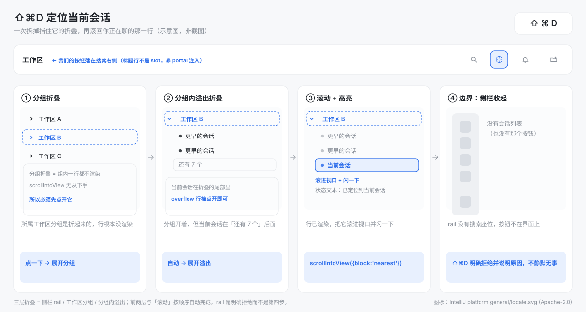
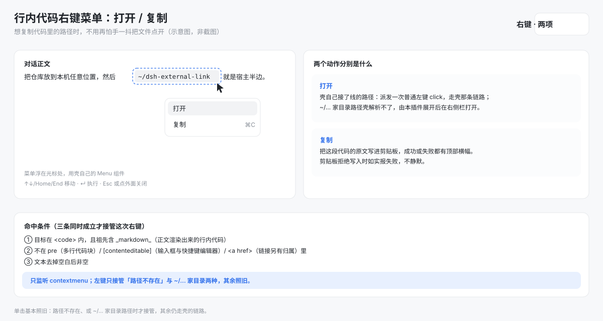
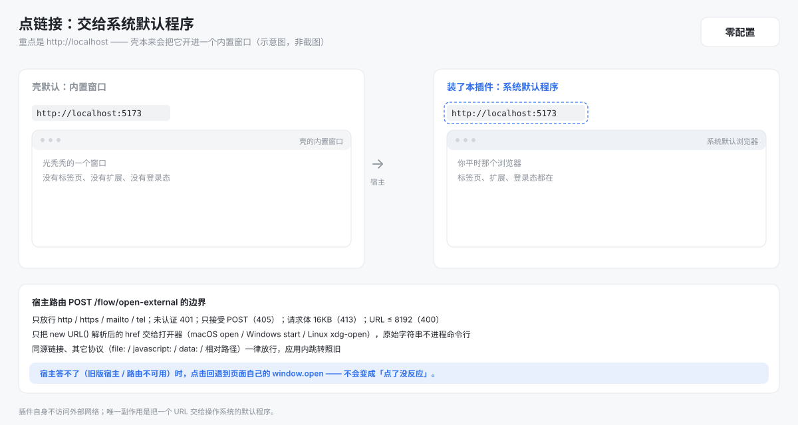
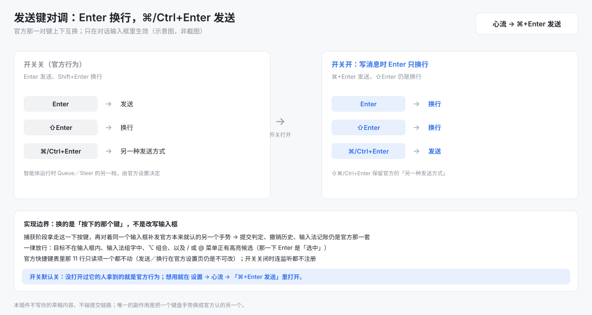

# dsh-flow

**心流优先：把 DSH 里那些「明明该顺手、却总要绕一步」的动作，改成符合直觉的样子。**



DSH 的日常里有一类摩擦，不是功能缺失，而是**动作方向和直觉相反**：

| 你的直觉 | 不做任何事时的行为 |
| --- | --- |
| 「我在聊哪个？把它拉回来」 | 侧栏分组叠着溢出，得靠手感滚 |
| 「我要的是这个会话的 ID」 | 只能手动选中再复制 |
| 「我只是想复制这行代码里的路径」 | 单击就把文件打开了 |
| 「这个链接该在我自己的浏览器里打开」 | 它被关进一个什么都带不进去的内置窗口 |
| 「我只是想换行，不是想发送」 | Enter 直接把半句话发出去了 |

一次修一条，让动作回到直觉上：**该回来的回来，该复制的别打开，该去外面的别关在里面，该换行的别发送。**

## 目录

- [一条原则，五个落点](#一条原则五个落点)
- [之后还会继续](#之后还会继续)
- [你什么时候需要它？](#你什么时候需要它)
- [它做了什么（三步，按顺序自动完成）](#它做了什么三步按顺序自动完成)
- [复制会话 ID](#复制会话-id) · [行内代码的右键菜单](#行内代码的右键菜单) · [链接用系统默认程序打开](#链接用系统默认程序打开) · [换行与发送对调](#换行与发送对调)
- [怎么装](#怎么装) · [装完怎么确认](#装完怎么确认) · [触发方式](#触发方式)
- [安全边界](#安全边界) · [已知限制](#已知限制) · [仓库里有什么](#仓库里有什么)

## 一条原则，五个落点

| 直觉上的动作 | dsh-flow 的做法 | 怎么触发 | 关掉 |
| --- | --- | --- | --- |
| 回到正在聊的那一行 | 先展开所属分组与分组溢出，再滚进视口并短暂高亮 | 标题行准星按钮 / `⇧⌘D` | 心流 → 定位当前会话按钮 |
| 拿到会话 ID | 复制这一行（或当前会话）的 ID，并给顶部横幅 | 会话行菜单 / `⇧⌘C` | 心流 → 复制会话 ID |
| 行内代码里的路径 | 右键出「打开 / 复制」；`~/…` 展开家目录再打开 | 正文行内代码上右键 / 左键 | 心流 → 行内代码右键菜单 |
| 用我自己的浏览器开链接 | 交给系统默认程序，**包括 `localhost`** | 直接点链接 | 心流 → 在系统默认程序中打开链接 |
| 写消息时 Enter 只换行 | 把官方那对键对调：Enter 换行、⌘/Ctrl+Enter 发送 | 输入框里直接按 | 心流 → ⌘+Enter 发送 |

五个落点互相独立：任何一个关掉都不影响其余四个，关掉的那个连监听都不注册。

## 之后还会继续

这个插件的方向不是「把功能堆多」，而是**把同一件事反复做**：DSH 里动作与直觉不一致的地方，一条条顺过来。之后新增的能力沿用同一套规矩——

- **单独开关**：不想用就关，关掉等于这个能力不存在；默认开，唯一例外是发送键对调——它改的是所有人都在用的 Enter，默认必须还是官方那一套；
- **不改变既有手势**：只在直觉需要的地方加一个入口，不重写你已经在用的动作（行内代码单击只在路径不存在、或 `~/…` 家目录路径上介入）；
- **有断言兜着**：现在 99 条纯逻辑测试 + 一份可复现的真浏览器验收，其中包含「普通单击不弹菜单」「只派发一次合成 click」「合成的手势不会被再改写一次」这类不变量。

所以下面的清单会变长，但主线只有一条。

## 你什么时候需要它？

- 侧栏里会话按工作区分组堆了几十行，你正在聊的那个不在视口里，得靠手感滚。
- 你刚点开过别的会话，又切回来，侧栏却还停在原来那一屏。
- 你想用键盘回到当前会话，不想离开输入框去摸鼠标。

## 它做了什么（三步，按顺序自动完成）

1. **所属工作区分组是折起来的** → 先展开分组（折叠的分组一行都不显示，滚动无从下手）。
2. **分组开着，但当前会话在「还有 N 个」后面** → 先展开溢出。
3. **行出现了** → 滚进视口，并短暂高亮一次。

侧栏整列收起（rail）时没有第四步：那种形态下按钮不在界面上，`⇧⌘D` 会直接告诉你原因。定位不到时也一样——当前会话不在侧栏筛选结果里、或当前没有打开的会话，都会用文字说明，不会按下去什么都没发生。

## 复制会话 ID

两个入口，同一个动作，复制完都有提示：

- **右键会话行**（或点行尾的 `...`）→ 菜单里的 **复制会话 ID**，复制这一行的 ID。空白「新会话」行按官方设计不开菜单，所以那一行没有这一项。
- **`⇧⌘C`**（Windows/Linux `Ctrl+Shift+C`）→ 复制当前对话的 ID，不用先找到那一行。Linux 的 Web 与 Desktop 不预置这个键（官方快捷键表把「主修饰键 + C」保留给浏览器自身的复制），在 **设置 → 通用设置 → 快捷键** 里绑一次即可；想换键也在同一处改，会话行菜单里的按键提示会跟着变。

剪贴板拒绝写入时提示失败，不会静默。

## 行内代码的右键菜单

对话正文里的行内代码（`` `path/to/file` `` 那种）点右键会浮出菜单，位置就在光标旁边。默认两项：



| 菜单项 | 做什么 |
| --- | --- |
| **打开** | 壳自己做成可点击的路径走壳那条链路（预览、文件管理器、系统默认程序都听壳的）；`~/…` 家目录路径壳解析不了，由本插件展开后在右侧栏打开 |
| **复制** | 把这段代码的原文写进剪贴板，成功或失败都有顶部横幅 |

`~/…` 指向**目录**时，菜单换成目录专用项（右键后探测一次，确认是目录才换）：

| 菜单项 | 做什么 |
| --- | --- |
| **在文件管理器中打开** | macOS 访达、Windows 资源管理器、Linux 文件管理器 |
| **用 VS Code 打开** | 只在本机装了 VS Code 时出现 |
| **用 Zed 打开** | 只在本机装了 Zed 时出现 |
| **复制** | 同默认菜单 |

- **单击照旧，只有两条例外**：路径存在、且壳自己接了线时，单击走的还是壳那条链路；路径**不存在**时，这一下左键被本插件接管，换成顶部一条非阻塞提示（壳原本会弹一个必须点掉的「path open failed」框）；`~/…` 家目录路径也一样由本插件接管。开关关掉时，右键、探测与这两条接管都不注册。
- **`~/…` 的家目录来自宿主**：取连接握手时那份 host facts 里的家目录（`os.homedir()`），拼成绝对路径后交给右侧栏预览（文件）或宿主文件管理器与编辑器（目录）；拿不到家目录时这一下原样留给壳，不猜。只认裸 `~/…` / `~\…`，`~alice/…` 这类命名用户形式不动。
- **目录项按本机应用列表生成**：宿主没装的应用不成行；探测回来之前先按默认两项渲染，探测给不出确定答案就不换。
- **只认对话正文里的行内代码**：多行代码块（三个反引号围栏）、输入框里的代码、链接文字都不弹菜单——链接照旧走下面的系统默认程序接管。
- **键盘可用**：↑↓/Home/End 在菜单项之间移动，回车执行，`Esc` 或点菜单外面关掉。
- **关掉**：设置 → **心流** → 「行内代码右键菜单」，默认开着。

**路径不存在时**：不打开、也不弹框，顶部给一条 `找不到这个路径 <这段代码>` 的提示。判定靠一次本机探测；探测给不出确定答案（宿主不在、超时、不是「不存在」那类失败）时一律照旧交给壳——宁可回到旧行为，也不把存在的路径误判成不存在；`~/…` 探不到确定答案时干脆什么都不做（壳本来也没有动作）。

## 链接用系统默认程序打开



| 点的是什么 | 结果 |
| --- | --- |
| 非同源的 `http` / `https` / `mailto` / `tel` 链接 | 交给系统默认程序（macOS `open`、Windows `start`、Linux `xdg-open`） |
| `http://localhost` / `http://127.0.0.1` | 同上——这是重点，壳本来会开一个内置窗口 |
| 本站内的链接 | 放行，应用内跳转照常 |
| 其它协议（`file:`、`javascript:`、`data:`、相对路径） | 放行 |

宿主路由是 `POST /flow/open-external`：先过 DSH 自己的连接信任栅栏（未认证 401），只接受 POST，只放行上面四种协议，URL 长度上限 8192、请求体上限 16KB。宿主答不了（旧版宿主、路由不可用）时点击回退到页面自己的 `window.open`，不会变成「点了没反应」。

> 这个能力原先由单独的 `dsh-external-link` 提供，现在合并进本插件。**两个不要同时装**：两边都会在捕获阶段拦同一个点击，链接会被打开两次。

## 换行与发送对调



官方输入框是「Enter 发送、`⇧Enter` 换行」，而官方的快捷键表里这两个是**只读**的（注册为固定输入，不给改）。本插件在设置 → **心流** → 「⌘+Enter 发送」里给你一个开关，默认关闭：

| 你按的键 | 开关关（官方） | 开关开 |
| --- | --- | --- |
| `Enter` | 发送 | **换行** |
| `⇧Enter` | 换行 | 换行 |
| `⌘Enter`（Windows/Linux `Ctrl+Enter`） | 另一种发送方式 | **发送** |
| `⇧⌘Enter` | 换行 | 官方的另一种发送方式 |
| `⌥Enter`、IME 组字中的 Enter | 官方行为 | 原样放行 |

- **不是重写输入框，是换手势**：插件在捕获阶段把这一下按键拿走，然后对着同一个输入框补发**官方本来就认的另一个手势**（要换行就补 `⇧Enter`，要发送就补裸 `Enter`）。所以提交判定、撤销历史、输入法记账全都还是官方那一套，插件的改动面只有「按哪个键」。
- **不抢菜单的回车**：`/` 或 `@` 菜单里有高亮候选时，Enter 是「选中」，插件此时完全不介入。
- **只作用于对话输入框**：队列编辑器、设置里的搜索框、别的插件面板都不受影响；开关关掉时连监听都不注册。
- **已知取舍**：开关打开后，「另一种发送方式」的键位从 `⌘Enter` 挪到了 `⇧⌘Enter`；插件不会去动官方快捷键表里那 11 行只读项。

## 怎么装

前置：本机有一个能跑的 DSH（DSH Desktop，或 `dsh` CLI 起在终端里的 `dsh web`）。

本插件**没有 npm 包**，分发形式就是这个仓库本身。把仓库目录放到本机任意位置，然后：

```sh
dsh plugin --profile web add /absolute/path/to/dsh-flow
dsh --profile web --dump-config        # 应出现 dsh-flow 层
```

刷新页面后侧栏标题行里就会出现那个准星按钮。

> 不要用 `npm install dsh-flow`：npm 上同名的 `dsh-flow` 是**另一位作者**的另一个插件（工作流自动化），与本插件无关。

## 装完怎么确认

肉眼确认：**侧栏标题行出现准星按钮，点它侧栏滚到当前会话**、**右键任一历史会话行能看到「复制会话 ID」**、**右键正文里的一段行内代码能看到「打开 / 复制」**，并且**点一条 `http://localhost` 链接开在浏览器而不是内置窗口里**，就装对了。


## 触发方式

- 定位：鼠标点侧栏标题行搜索图标右侧的准星按钮；键盘 `⇧⌘D`（macOS 桌面版走的是 web 快捷键通道，因此也是 `⇧⌘D`），Windows/Linux 为 `Ctrl+Shift+D`。
- 复制：右键会话行选 **复制会话 ID**；或按 `⇧⌘C`（Windows/Linux 为 `Ctrl+Shift+C`，Linux 要自己绑一次）复制当前会话的 ID。
- 改键：设置 → **通用设置** → **快捷键**，两条命令都在里面；改完会话行菜单里的按键提示同步更新。
- 外链：直接点链接即可；**关掉**在设置 → **心流** → 「在系统默认程序中打开链接」。
- 行内代码：在对话正文里对一段行内代码点**右键**；**关掉**在设置 → **心流** → 「行内代码右键菜单」。
- 换行：输入框里按 `Enter` 就是换行（要先打开设置 → **心流** → 「⌘+Enter 发送」），发送改成 `⌘Enter`（Windows/Linux 为 `Ctrl+Enter`）。
- 关掉其它功能：设置 → **心流** → 对应的那个开关。

## 安全边界

- **只动视图，不动数据**：滚动、展开分组、闪一下高亮。不归档、不删除、不改会话排序、不写会话内容。
- **复制只写剪贴板**：一次 `navigator.clipboard.writeText`，内容是会话 ID 本身；不读剪贴板、不落盘。
- **不静默复制**：每次复制都有顶部横幅（读屏一侧是 `role="alert"`），失败也照说。
- **持久化写入**只有「心流」页里你按的那五个开关（宿主 Config 的 `flow.locateButton` / `flow.copySessionId` / `flow.externalLink` / `flow.codeMenu` / `flow.modEnterSend`）。
- **不注入、不落盘、不改输入框内容**：发送键那一项只是把按下的键换成官方认的另一个手势，读写草稿、提交、撤销全都仍由官方输入框自己完成。
- **外链只交给本机宿主**：`POST /flow/open-external` 打的是页面自己所在的 DSH 实例，URL 由宿主转交操作系统默认程序；插件自身不访问外部网络，也不读凭据。
- **不抢别人占用的快捷键**：默认键在注册时就校验冲突，宁可报错也不用你的按键盖掉别的命令。
- **不静默失败**：拒绝按下时给出原因文字（读屏也能读到）。
- **不发外部网络请求**、不读凭据、不碰 `localStorage`。
- 官方包版本写的是 `^0.2.0-rc.2` 且标为可选：装到别的 DSH 版本上不会报错装不上，但那种组合没验证过。

## 已知限制

- 侧栏折叠成 rail 时**没有按钮**（标题行没有搜索座位），快捷键在该形态下被拒绝。
- 当前会话被侧栏的搜索或「仅归档」筛选挡掉时，定位不到——会明确说明，不会帮你清筛选。
- 只能定位**已渲染**的会话行；分组折叠与分组溢出这两层会替你展开，其他筛选不会。
- **Linux 不预置 `⇧⌘C`**：官方快捷键表把「主修饰键 + C」判为 reserved，声明它会在注册时抛错、连带整个客户端半边不挂载，所以那里留空，由使用者自己绑。
- 「复制会话 ID」跟着官方会话行菜单走：空白「新会话」行按设计不开菜单，那一行也就没有这一项。
- **不要和 `dsh-external-link` 同时装**：两边都在捕获阶段拦同一个点击，链接会开两次。
- 点了外链之后的行为由操作系统决定（用什么浏览器、是否提示），本插件只负责把 URL 交出去。
- 行内代码菜单只覆盖**对话正文**（markdown 正文）里的行内代码：多行代码块（`pre > code`）、输入框与快捷键编辑器里的代码、行内代码里的链接都不弹菜单。
- 「打开」对壳既没做成可点击、又不是 `~/…` 的行内代码（例如普通的一段 `main`）没有动作——它就是一次普通左键单击，而左键单击同样没有动作。不会为这类代码做存在性探测。
- 单击一条**指向不存在路径**的行内代码、或任何 `~/…` 行内代码，都会多一次本机探测往返；其余单击的响应与不装插件时一致。
- `~/…` 打开的是**宿主账号的家目录**文件，经右侧栏预览；拿不到家目录、没有当前会话、或侧栏控制器不可用时，这一下什么都不做。
- 发送键对调**只在对话输入框里生效**，且只换「按哪个键」：官方那 11 行只读快捷键（含 `发送`/`换行`）本身不会被改写，官方设置页里它们仍显示为不可改。
- 界面文案中英双语，跟随客户端语言；本仓库文档只有中文。

## 仓库里有什么

| 路径 | 作用 |
| --- | --- |
| `client.js` | 浏览器半边（零构建，就是产物本体）：按钮、portal、会话行菜单项、两条快捷键命令、定位与复制逻辑、复制提示、外链点击拦截、行内代码右键菜单与 `~/…` 家目录打开、发送键对调 |
| `index.js` | 宿主半边：五个 volatile Config 字段 + 「自带页面」策略 + `POST /flow/open-external` 路由（协议白名单与平台打开器） |
| `tests/` | 99 条 `node --test`：纯逻辑与接线断言 |
| `scripts/verify-browser.mjs` | 真浏览器验收（真实鼠标/键盘事件，`--client` 可把开发中的浏览器半边替换进去） |
| `scripts/render-assets.mjs` | 生成 README 里的示意图（SVG + 2x PNG） |
| `assets/` | 示意图产物（手绘生成，不含任何真实会话） |
| `THIRD-PARTY-NOTICES.md` | 按钮图标的出处与 Apache-2.0 正文 |

面向改这个插件的人（架构理由、官方 DOM 契约、运行中实例的缓存规则）：见 [`AGENTS.md`](AGENTS.md)。
